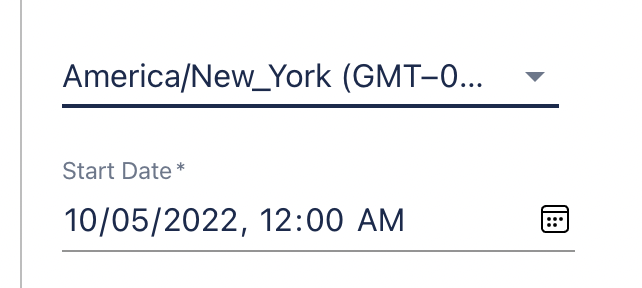

# Arena Platform

## 10 May 2022
- Added the ability to create an event-based a given timezone
  
- Added new scoring modes. You can now set your Tournament to run on the following scoring modes:
  - Best Score: The best score of the player
  - Incremental: the total score of the player
  - Latest: The last score of the player
- Added a new Test Campaign Feature. 
- All events now have an [Entry Type](../dashboard/creating-events#entry-type), using which you can define how players can enter the event. 

