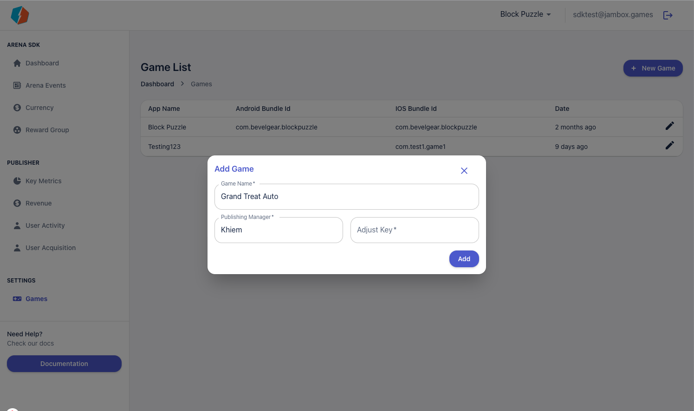

# Adding Games

You can add your games to the Arena SDK platform by heading over to the [games page](https://app.jambox.games/dashboard/games). You can also access this page from the left menu. 

To add a game, just click on the add game button on the top right and provide the required information. 

Once a game is added, you can click on the edit action of any game to provide more details to the system 