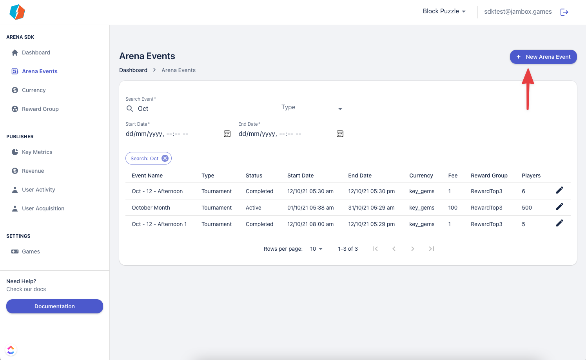
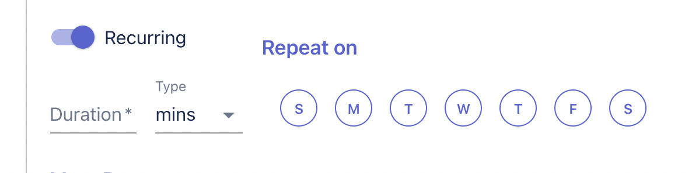

# Creating Events

The Arena Dashboard allows you to create 2 kinds of events, with Friendly tournaments being created by the players in the client. 

To create an event head over the Arena Events page and click on the New Arena Event button



Make sure you have a [Currency and a Reward Group](./reward-currency) created
  
To create an event you will need the following 
- A Name and description for the event
- The type of tournament you want to create
- The [Entry Type](#entry-type) and Fee and the type of currency if you are using a currency.
- A start date and duration of the event.
- The number of attempts you want your players to get
- The maximum size of a leaderboard, Each tournament can have multiple leaderboards, each fixed to a max limit you specify.
- Any additional [MetaData](#metadata)

You can even set up recurring events if you want your events to be repeated 



## Entry Type
Arena Provides 2 kinds of entry mechanism to each event. 

- Enter with Currency: You can specify any currency and the amount required to enter the event. Free events can be specified with 0 as the currency value. 
- Entry with Rewarded Ads: This event can only be entered with a rewarded Ad. These events also don’t have a limit on the number of attempts for a user.

## Metadata

Let's say yours is a racing game with 2 modes: Race & Drift and you have different tracks for different modes. Ideally, you want to use different tracks and modes for each event, which requires you to pass the data to the client-side, that is where the MetaData feature comes into play.

You can define any JSON key-value pair for an event in Jamboard Arena using Metadata. This allows you to pass information like the environment to load back to the client. Thus if you wanted to load a track say “Monaco” and have the event type as “Race”, you could pass the following JSON, and have your client use the same.

```json
{
  "type": "race",
  "track": "monaco"
}
```

You can set up more complex JSONs like

```json
{
  "type": "race",
  "track": "monaco",
  "player": {
    "powerup": "2xNitro"
  },
  "bots": [
    {
      "Count": 2,
      "skillLevel": 90,
      "carType": "Derby"
    },
    {
      "Count": 5,
      "skillLevel": 50,
      "carType": "Rally"
    },
    {
      "Count": 1,
      "skillLevel": 110,
      "carType": "F1"
    }
  ]
}
```


Here we are requesting the client load the following 

- **Track**: Monaco
- **Type**: Race
- **Player Boost**: 2X nitro
- **Bot spread**: 2 Derby type cards with 90 skill level, 5 Rally type cars with 50 skill level and 1 F1 car with 110 skill level. 
