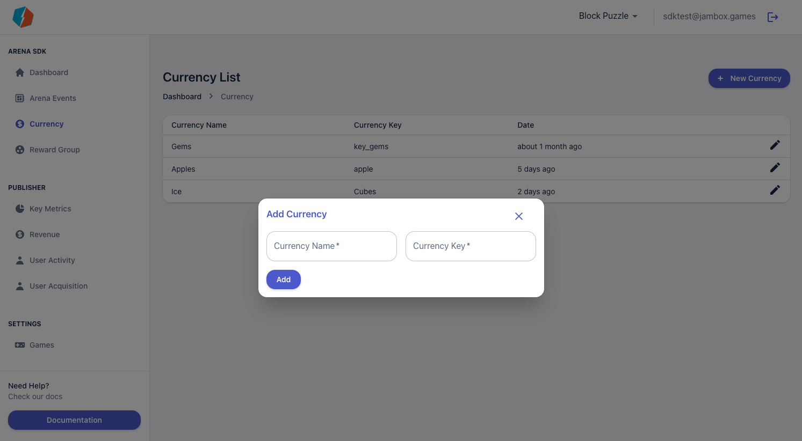
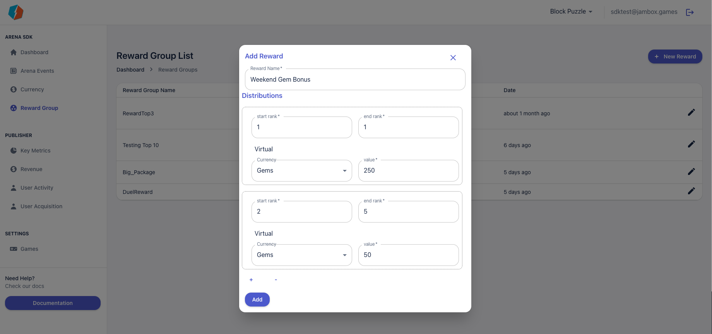

# Reward Groups and Currencies 

Arena Events is all about players paying some form of currency to compete and winning a reward. To make it easier to create and manage events the Arena SDK dashboard allows you to define your currencies and Reward Groups

## Currencies

Currencies consist of a Currency display name and a key. The Display name is used on the dashboard and the key is used to let the game identify the currency. Creation of a currency is a simple process and just needs the 2 inputs

## Reward Groups 

Each event you create can have a multiple rewards defined by the rank of the players. Each group defines the rank the reward is eligible for and the reward itself. Creating reward groups also saves you effort while creating events

