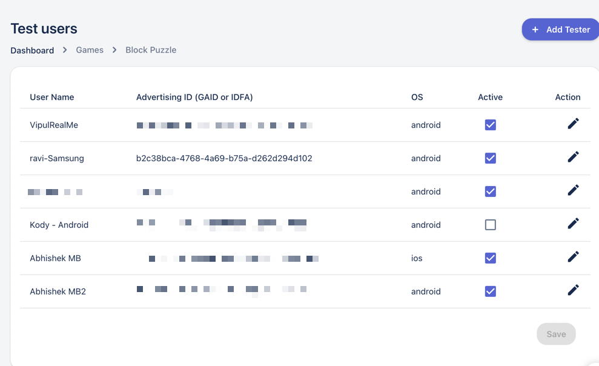

# Testing Events

Test events are only visible to test users, this is great for testing an event before it goes live to your users. 

The Arena SDK provides two mechanism for testing events. 

## Testing via the Dashboard
You can set a set of your user as test using by defining either GAID or IDFA on the Test panel.



## Creating Test Builds

You can also set up your entire build to be test build by passing a boolean to `isTestUser` while [initialising the SDK](../sdkdocs/initialization#step-1)

```cpp
    using Jambox.Tourney.Connector;

    void Initialize()
    {
        bool IsTestUser = true;
        ArenaSDKEvent.Instance.InitializeArenaSdk("GameUserName","game-user-id",IsTestUser);        
    }
```