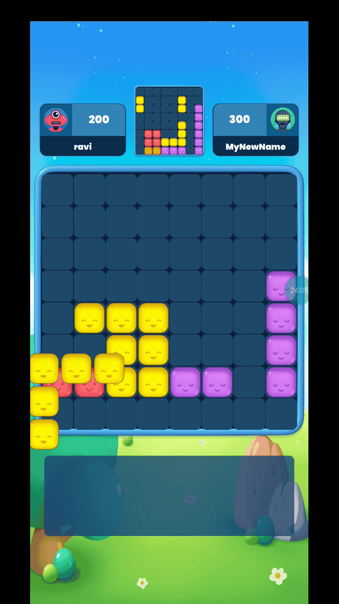

# Async Multiplay

Competition is always enhanced when you recieve feedback from the game or sport you are playing. From score boards to health bars, this feedback has allows players to feeling the pressures and emotion of the games.

Jambox's Async Multilplay System allows you to give your players the same experience without needing to build a full fleged Multiplayer game. The Async Multiplay system works in tandum with the Arena SDK to give your players a complete competitive experience. 

Async Multiplay allows you to record your players gameplay for replaying it later. When another player is matched aganist this player, the Async Multiplay system returns all the data you recorded, thus allowing you to re-simulate the player.

Here is an example of Async Multiplay in action, the player is competing aganist a real player here, but not in real time

