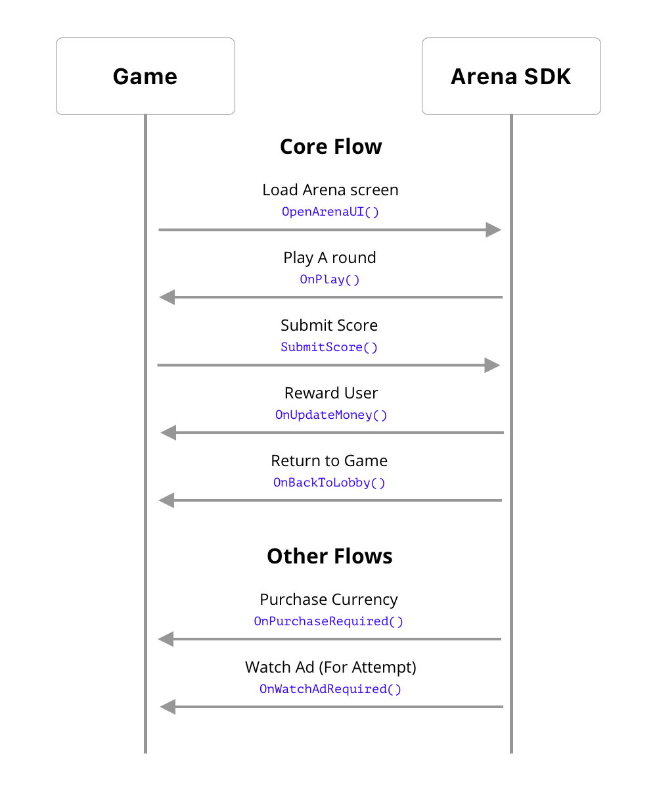

# How It Works

The Arena SDK does most of the heavy lifting for you. It takes care of listing all available events, showing leaderboards, matchmaking, etc.

It provides a score-based competitive system. As long as your game has any mechanism of scoring, you can use the service.
 
The Arena SDK provides a fully managed client front end with its Unity SDK. You don't need to design new screens to support the competitive features described here.
 
The Arena Dashboard allows you to [create events](../dashboard/creating-events) from the dashboard. As described in the introduction, there are 3 kinds of events: Tournaments, Duels, and Friendly, the last of which you can't create from the dashboard.
 
When you create an event you define all the event details including how the leaderboard scoring will work, and even provide the metadata for the event, like the map to be used, etc.
 
The events you create will be visible to all your players, and when a player decides to play in an event the SDK calls on the game to start a round passing all the data required. Once the round is completed the game can submit a score to the Arena service.
 
The flow between the Game and the SDK is shown below:

 
You can also pass information to the SDK at various points, like the name of the player, of the amount of currency the player holds. Please check the SDK docs for a complete list of interactions between the SDK and your Game.