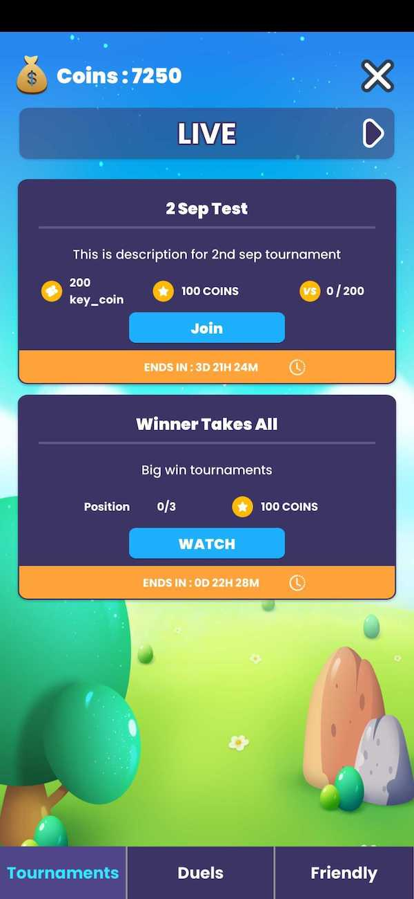

# Introduction - Arena SDK

The Jambox Arena SDK helps game developers convert their single player games into Competitive multiplayer games. 
The SDK allows you to run competitive formats like Tournaments, Duels and Friendly Tournaments where the infrastructure and core services like match making is completely managed for you. 
As players spend more time in the game competing with other players you will see a lift in engagement and revenue metrics. 
## The competitive Formats 
Arena SDK provides 3 competitive formats, each with their own benefits. 

### 1. Tournaments
Tournaments allow your player to complete with other players to either win in game currency or in game items. You can define the entry fee and currency for each tournaments. Thus you can have tournaments where: 
1. Users play for free to win soft currency like coins
2. Users spend soft or hard currency like coins or gems to win in-game items like Loot boxes, weapons or skins. 
The second scenario allows you to increase the spends on the usage of hard currency, which the users will need to top up with IAPs, thus increasing revenue generation in the game. 

[Read More](tournaments.md)

### 2. Duels  
Duels is a competitive format which allows your players to instantly match up, and compete with other players. The results provided instantly. 
Duels are 1 v 1 single attempts tournaments, here the player puts in a wager defined for each duel and can win the amount defined by you.

[Read More](duels.md)

### 3. Friendly Tournaments 
In this format, your players can set up private tournaments to play with your friends. As with Duels, you can define a base entry cost for each friendly tournament, but the winning amount

[Read More](friendly.md)

