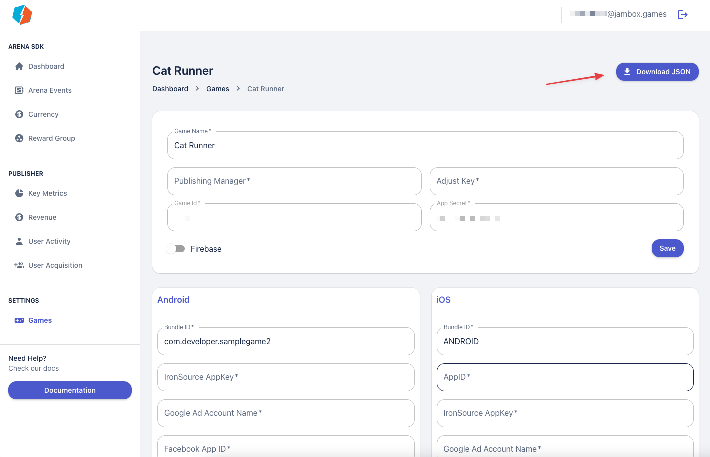

# Installation

- Download the Jambox SDK package from the links provided to you by your publishing partner.
- Double click on the downloaded Arena SDK Package and import it into your Unity package. A dialog will pop up where you can choose the assets from the package to import. Click the 'All' button to make sure everything is checked. Next, click the 'OK' button.
- The Jambox Arena SDK is now installed in your Unity project. You should see an Assets/JamboxPublishing/ folder in your project tab.
- Add `JamboxPublishing.prefab` in your Main UI Scene.
- Create an account on the Jambox Dashboard and add your game. 
- Download the metaSdk.json file from our developer portal under the games section and save it inside asset/JamboxPublishing Folder. Reference it inside JamboxPublishing Prefab to that all the SDK will be initialised.

- For firebase, download goole-services.json file from the Firebase console and add it to the asset folder.  
- Edit the Facebook setting of your App with our Facebook AppID.
- The Jambox team will provide you with the other keys.
