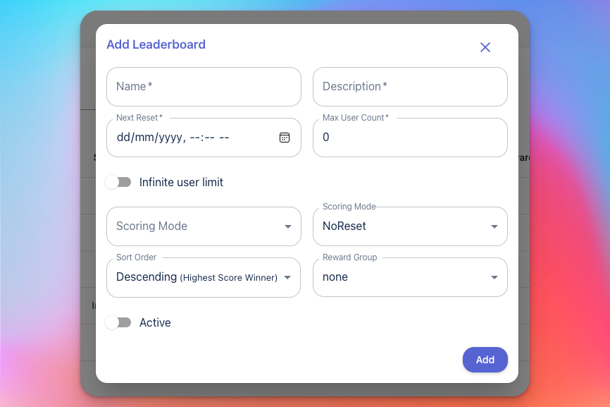

# Arena Leaderboards

## Overview 

Jambox Arena Leaderboards allows you to provide a ranked leaderboard to your players. You can have as many leaderboards as you want.

Arena Leaderboards have the following features 
- Partitions, i.e you can split your players by any specified tags, eg Country, Level etc. 
- Buckets/Segments, Each Partition leaderboard can further be limited to a max Bucket size, so that a leaderboard will limit the numbers of players in the bucket, and multiple buckets will be created. 
- Rewards: A Reward group can be attached to the leaderboard so that you can reward your players. For rewards Groups to function, the leaderboard should have a Reset period defined  

## Creating Leaderboards 

Creating Leaderboards is a simple process that takes only a few steps. Here are the parameters it needs 

- Name 
- Description 
- Infinite User Limit: Enable to disabled bucketed Leaderboards 
- Max User count: Set the bucket size if enabled. 
- Scoring More: Define how the leaderboard will be scored, one of Best Score/Incremental/Latest.
- Reset Period: How often will the leaderboard rest
- Sort Order: How the leaderboard will be sorted 
- Reward Group: The attached Reward Group. 



## Leaderboard APIs

### Submit Score 

```cpp
/// <summary>
        /// This method will be called from UI to submit the user score to the leaderboard
        /// </summary>
        /// <param name="LBId">Leaderboard ID.</param>
        /// <param name="partitionKey">Partition Key for leaderboard. If no partition then pass empty string("") </param>
        /// <param name="score"> Score to be passed to leaderboard </param>
        /// <param name="DisplayScore">A formatted score if Gmae wants to show (e.g. 100.34 sec)</param>
        /// <param name="OnReceived">The Action on completion of this particular task.</param>
        /// <returns></returns>
        public async Task SubmitLBRecord(string LBId, String PartitionKey, ulong score, string DisplayScore, Action<ISubmitScore> OnReceived)
```


### List Leaderboards 

```cpp
        /// <summary>
        /// This method will be called from UI to get all the active leaderboards details.
        /// </summary>
        /// <param name="OnReceived">The Action on completion of this particular task.</param>
        /// <returns></returns>
        public async Task GetLeaderboardList(Action<ILeaderboardList> OnReceived)
```

### Fetch Members

```cpp
        /// <summary>
        /// This method will be called from UI to get all Leaderboard User Records.
        /// </summary>
        /// <param name="LBId">Leaderboard ID.</param>
        /// <param name="partitionKey">Partition Key for leaderboard. If no partition then pass empty string("") </param>
        /// <param name="OnReceived">The Action on completion of this particular task.</param>
        /// <returns></returns>
        /// 
        public async Task GetLeaderboardRecord(string LBId, string partitionKey, Action<IApiLeaderRecordList> OnReceived)
```


###  Get Last Played Leaderboard

```cpp
        /// <summary>
        /// This method will be called from UI to get the Last ended leaderboard result
        /// </summary>
        /// <param name="LBId">Leaderboard ID.</param>
        /// <param name="OnReceived">The Action on completion of this particular task.</param>
        /// <returns></returns>
        public async Task GetPreviousLeaderBoard(string LBId, Action<IApiLeaderRecordList> OnReceived)
```

### List Unclaimed Rewards

```cpp
        /// <summary>
        /// This method will be called from UI to get all the unclaimed reward for user 
        /// </summary>        
        /// <param name="OnReceived">The Action on completion of this particular task.</param>
        /// <returns></returns>
        public async Task GetPendingLBReward( Action<IPendingReward> OnReceived)
```

###  Claim Rewards

```cpp
        /// <summary>
        /// This method will be called from UI to get the Last ended leaderboard result
        /// </summary>
        /// <param name="LBId">Leaderboard ID.</param>
        /// <param name="ClaimAll"> Flag to set if client wants to claim for all the pending rewards for multiple leaderboard</param>
        /// <param name="OnReceived">The Action on completion of this particular task.</param>
        /// <returns name = ></returns>
        public async Task ClaimLBReward(string LBId, bool ClaimAll, Action<IClaimReward> OnReceived)
```
