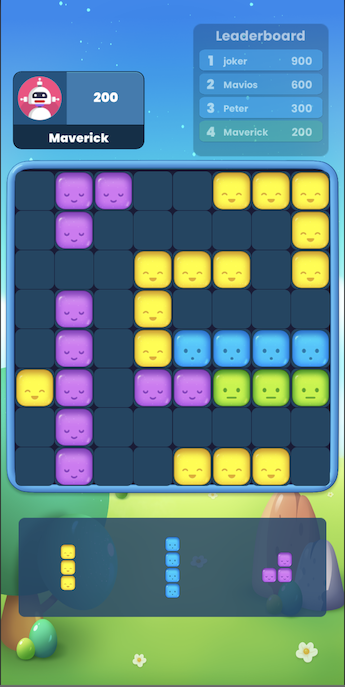
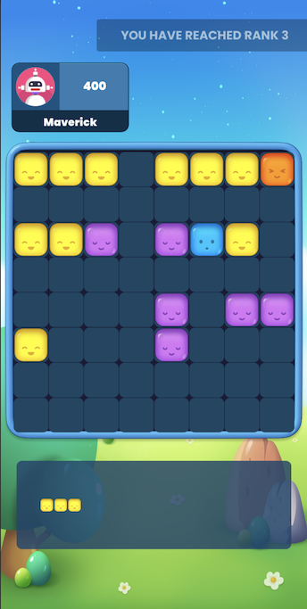

# Realtime Visual System For Tournaments

Arena SDK provides widgets to show real-time leaderboard updates and ranks for the players in tournaments mode. As the players’ score changes, the player will climb the leaderboard rank. 

### Variation 1 - Developer can show a full leaderboard 



### Variation 2 - Notification widget



The game can initialize the real-time leaderboard for tournaments when it gets the match object in OnPlay event. The widget will be initialized based on all the parameters passed as arguments to the function.

The widget comes with customizations to suits the game UI. Developer can initialize the widget with these customization variable.

``` cpp
    //leaderboardData - pass Leaderboard field from Match object passed in OnPlay event
    //scrollable - if the widget list needs to be scrollable
    //NoOfRecordsToShow - number of user data to show in widget
    //disappearingLB - make it true if you want the widget to come only on rank change. If set false, widget will always be shown on ui
    //fullLeaderboard - if set false, widget will a one line notification showing the player rank
    public void InitializeRealtimeLeaderboard(List<leaderBoardData> leaderboardData, bool scrollable, int NoOfRecordsToShow, bool disappearingLB, bool fullLeaderboard)
        {
            //function body
        }

```

``` cpp
private void OnPlayHit(Match matchData)
    {
        // code before

        if((matchData.matchType == EMatchType.EMatchTypeTourney || matchData.matchType == EMatchType.EMatchTypeFriendly) && matchData.Leaderboard != null)
        {
            ArenaSDKEvent.Instance.InitializeRealtimeLeaderboard(matchData.Leaderboard, false, 4, false, true);
        }
        
        // code after
    }
```

As the tournament game starts and user starts scoring, game needs to pass the score to the SDK system so that it updates the score on widget and also rank if there is any change in it. 

``` cpp
        public void UpdatePlayerScoreOnRealtimeLB(long _score)
        {
            //function body            
        }
```


``` cpp
        //Call UpdatePlayerScoreOnRealtimeLB in Score Manager class of Game
        ArenaSDKEvent.Instance.UpdatePlayerScoreOnRealtimeLB(Score);
```