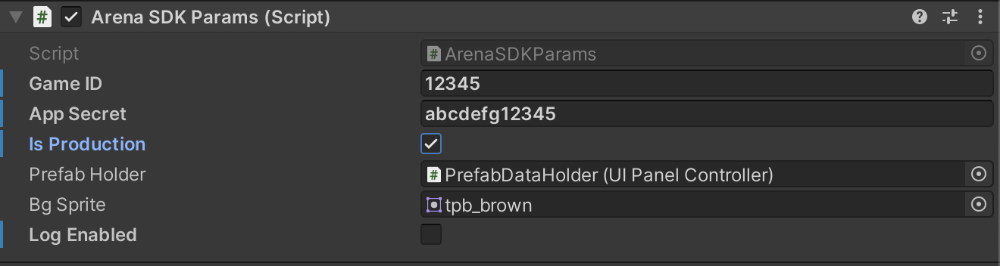

# Going Live & Best Practices 

## Best Practices
- Arena helps you to Grow overall engagement time and thus Ad or IAP revenue. 
  - If your model is Ad revenue, make sure you show an interstitial after every attempt. The Arena SDK had a feature where the player gets additional attempts by watching a rewarded Ad, make sure you have set that up correctly 
  - If your model is IAP driven make sure you have tournaments that require the players to spend hard currency to win In-game items.
- Always have multiple events created for both Duels and Tournaments. 
- If your games fit duels, you can have an additional button that directly takes players to duels. 
- Always make sure that your gameplay is limited by either time or environment.
- Make sure you are passing as much information as possible to the Async Replay system, it improves the experience of the user.
- If your game already asked users for their names, please pass the same to Arena 
- Always show a score, that is critical feedback to your players and where they stand
- Always have a score or some mechanism to provide feedback to players as to how well they are doing vs the competitor (Ahead/behind, etc). This can be one vs one score, or a leader board
- Tips for Async Replay
  - Remember Async Replays don’t support interaction, thus plan your replays accordingly. 
  - Plan the data you want to collect for Replays. Anything that can be deterministily performed on the client, should not be passed into the replay data system, anything that can’t should be  

## Checklist 

Before going live with Arena SDK, Developers should use this checklist to make sure all the features/flow are implemented
 
- Display Tournament, Duels and Friendly list
- Join and Play Tournaments and Duels
- Create and join Friendly Tournament
- Tournament Real-time leaderboard visualization
- Async Multiplay Visualization for Duels
- Play after purchase flow in case the user doesn't have currency to join the tournament. Users should come back to the Tournament screen after making a purchase in the game for currency
- Test after “Watching Ad flow” in case attempts are exhausted for the user in tournaments. After watching a Rewarded video ad, the user should be able to play the attempted tournament.

## Moving to Production

Before making the build for Google / Apple store deployment, the developer should switch their game environment from staging to production.
Enable the `IsProduction` flag in ArenaSDKParams attached to the panel controller in JamboxCanvas prefab.

