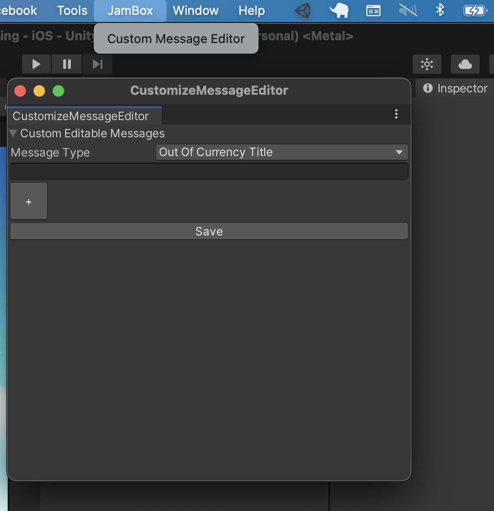
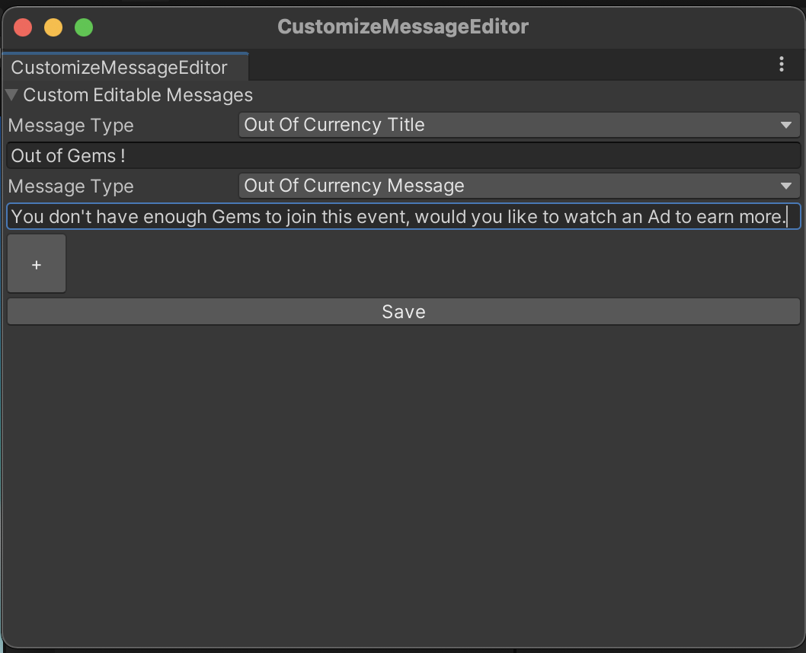

# UI Messages Customization

Arena SDK provides functionality to customize your UI messages. You can set your own messages for various UI elements according to your choice which suits the game.

To customize the message, go to Jambox > Custom Message Editor. 

You can select the message to change from the drop down menu and update the message in the text box. Once updated you should save the messages. Save option will create a file in your project at 'Assets/Resources/ConfigMessage.json'. 

Run your game now and check the updated messages. Wow that was easy !!
