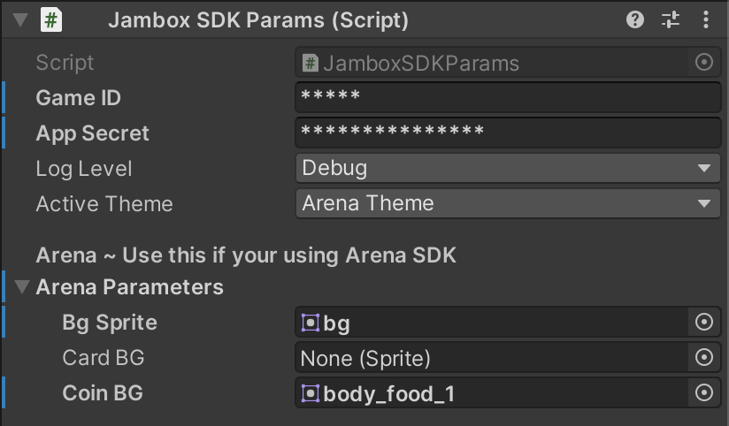

# SDK - Initialization

## Step 1 
Add `Assets/Jambox/Prefabs/JamboxCanvas.prefab` in your Main UI Scene. Once done, click the JamboxCanvas Object in the Unity Editor and set the `game secret key` and `game id`. You can get values from your publishing manager.

Call the `InitializeArenaSdk` function of the ArenaSDKCommunicatior to initialize the SDK. This will authenticate the user and create a user session. 

You should provide the unique `userID` if avaliable. If there is no user id provided, Arena SDK will generate it own identifier.

Games can also provide a username/display name. The SDK will use the same name for the user within its screens. If no username is provided, SDK will ask for a username when initialized for the first time.

```cpp
    public void InitializeArenaSdk(string userName = null, string userID=null)
    {

    }
```

## Step 2
Once the Arena SDK is initialized, You can open the prebuilt multiplayer UI for various SDK features. You should typically provide a button on your main UI screen to initialize the Arena SDK multiplayer UI.

```cpp
    public void OpenArenaUI(Dictionary<string, long> currencyMap = null)
    {

    }
```

## Step 3
Background image of Arena SDK UI is configurable and can be changed by the developer. You should be providing a BG such that the Arena SDK UI mathces the theme of the Game. You can set the desired image in the `BG Sprite` field of ArenaSDKParams script attached to JamboxCanvas Object.



## Step 4
Games need to share their currency details to the Arena SDK while opening SDK UI. 
Arena SDK will be using the currency values provided by you to decide whether the user has enough money to play tournaments or not.

```cpp
    // Open Tournament Panel by providing money details
    Dictionary<String, long> MoneyDetail = new Dictionary<string, long>();
    MoneyDetail.Add("coin", UserMoney);
    ArenaSDKEvent.Instance.OpenTournamentPanel(MoneyDetail);
```
